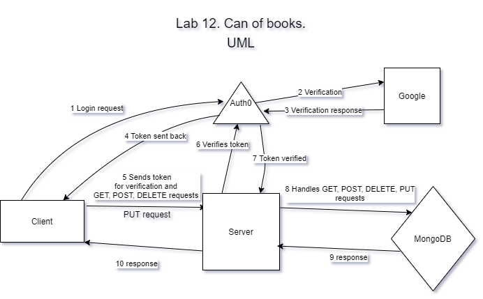

# Can of Books App (front-end)

**Author**: Ayrat Gimranov, Jamison McGrath (Brutal)
**Version**: 1.0.5

## Overview
<!-- Provide a high level overview of what this application is and why you are building it, beyond the fact that it's an assignment for this class. (i.e. What's your problem domain?) -->
In this module, we added a functionality, so that a user can select and update information  of individual books, such as title and description, provided authentication is valid.

## Getting Started
<!-- What are the steps that a user must take in order to build this app on their own machine and get it running? -->
- set up fron-end and back-end
- hook the front-end up to Auth0 using Auth0 docs
- hopp the back-end up to Auth0 to verify tokens received from front-end
- wire up front and back-end to complete the cycle;
- connect to Mongo database
- add routes that handle get, post and delete routes
- add routes to handle put request to update individual book info

## Architecture
<!-- Provide a detailed description of the application design. What technologies (languages, libraries, etc) you're using, and any other relevant design information. -->

This app uses HTML, CSS, JS, React, React-Bootstrap, Node.js (express), MongoDB, OAuth-Auth0, Trello.  

## Change Log
<!-- Use this area to document the iterative changes made to your application as each feature is successfully implemented. Use time stamps. Here's an example:

01-01-2001 4:59pm - Application now has a fully-functional express server, with a GET route for the location resource. -->
8/15/2021 - Bsaic repo set up done.
8/16/2021 - App receives the token from auth0, sends a test request to server which verifies the token with auth0 and returns the user info to front-end.
8/19/2021 - Server verifies user token, then reads data from MongoDB and sends to front-end for display
8/24/2021 - Added POST and DELETE requests to add or delete a book from the database with valid authentication
8/26/2021 - Added PUT request to allow users to update selected book information

## Credit and Collaborations
<!-- Give credit (and a link) to other people or resources that helped you build this application. -->
Jamison McGrath (Brutalism) - team member,
Ryan Gallaway
Clarissa Pamonicutt - helped set up basic repo
Heather Bisgaard helped in starting the repos setup and provided nitial UML
JP
Alex
Chris
Phil
TA's

## Time Estimates

Name of feature: 1. Update: As a user, I want to update book details on my list, so that I can change the book status, or update the book details as I learn more about it.

Estimate of time needed to complete: 7 hrs

Start time:  9 pm

Finish time:  4 am

Actual time needed to complete:  7 hrs
